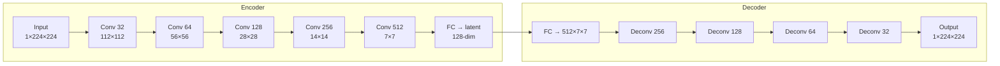
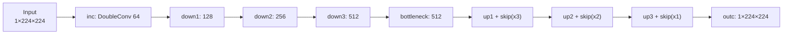
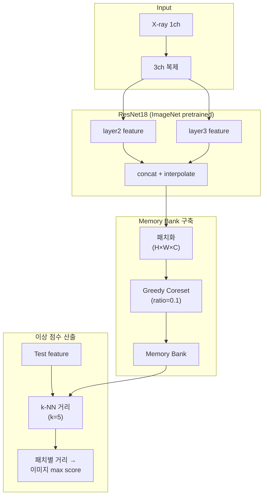
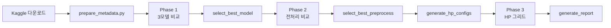

# 흉부 X-ray 기반 폐렴 이상탐지 프로젝트 보고서

**학번:** 202647007  
**이름:** 기경현  
**제출일:** 2026년 6월 16일

---

## 요약

본 프로젝트는 **정상(NORMAL) 흉부 X-ray만으로 학습**하는 비지도 이상탐지(unsupervised anomaly detection) 파이프라인을 구축하고, 폐렴 이상을 탐지하는 성능을 평가하였다. Conv AutoEncoder, U-Net AutoEncoder, PatchCore 세 가지 모델을 3단계 실험(모델 비교 → 전처리 비교 → 하이퍼파라미터 탐색)으로 체계적으로 비교한 결과, **PatchCore + enhanced 전처리 + image 256 / k=5 / coreset 0.1** 구성이 RSNA 검증셋(Exp2) 기준 **AUROC 0.637**으로 최고 성능을 기록하였다.

**키워드:** 흉부 X-ray, 이상탐지, PatchCore, 도메인 일반화, AUROC

### 필수 제출 항목 대응


| 필수 항목                           | 본 문서 위치              | 상태  |
| ------------------------------- | -------------------- | --- |
| 문제 정의                           | §1                   | ✅   |
| 데이터셋 설명 (출처, train/val/test)    | §2                   | ✅   |
| 사용 모델 설명 (구조 그림)                | §3                   | ✅   |
| 성능 비교 방법 (모델·전처리·HP·Pretrained) | §4                   | ✅   |
| 성능 (지표, inference time)         | §5, §4.5             | ✅   |
| Code 구조                         | §6                   | ✅   |
| 학습 Log                          | §7, `결과모음/train.log` | ✅   |


> **범위:** 본 보고서는 **Phase 1~3** (총 21 runs) 실험 결과를 기준으로 작성하였다.

---

## 1. 문제 정의

### 1.1 배경

의료 영상에서 폐렴과 같은 이상을 조기에 탐지하는 것은 임상적으로 중요하다. 그러나 이상 사례(질환) 데이터는 정상 데이터에 비해 수집·라벨링 비용이 크고, 병원·촬영 장비·환자 특성에 따라 데이터 분포가 달라 **도메인 갭(domain gap)** 문제가 발생한다.

### 1.2 문제 정의

본 과제의 핵심 문제는 다음과 같다.

> **정상 흉부 X-ray만으로 학습한 모델이, 학습에 사용되지 않은 외부 데이터셋(RSNA)에서도 폐렴 이상을 효과적으로 탐지할 수 있는가?**

이를 위해 다음 조건을 설정하였다.


| 항목           | 설정                                |
| ------------ | --------------------------------- |
| 학습 방식        | 비지도 학습 (정상 영상만 사용)                |
| 탐지 대상        | 폐렴(PNEUMONIA) 이상                  |
| 1차 평가 (Exp1) | 학습과 동일 도메인 — Chest X-ray test     |
| 2차 평가 (Exp2) | 외부 도메인 — RSNA Pneumonia Detection |
| 우승 기준        | **Exp2(RSNA) AUROC 최대**           |


### 1.3 연구 목표

1. 세 가지 이상탐지 모델(Conv AE, U-Net AE, PatchCore)의 성능을 동일 조건에서 비교한다.
2. 전처리(basic vs enhanced)와 하이퍼파라미터 튜닝을 통해 RSNA 일반화 성능을 최대화한다.
3. 재현 가능한 실험 파이프라인(Phase 1~3)을 구축한다.

---

## 2. 데이터셋 설명

### 2.1 데이터 출처


| 데이터셋                         | 출처                                                                                                                        | 용도                              |
| ---------------------------- | ------------------------------------------------------------------------------------------------------------------------- | ------------------------------- |
| **Chest X-ray Pneumonia**    | [Kaggle — paultimothymooney/chest-xray-pneumonia](https://www.kaggle.com/datasets/paultimothymooney/chest-xray-pneumonia) | 학습(train/val) + 동일 도메인 평가(Exp1) |
| **RSNA Pneumonia Detection** | [Kaggle — rsna-pneumonia-detection-challenge](https://www.kaggle.com/c/rsna-pneumonia-detection-challenge)                | 외부 도메인 평가(Exp2)                 |


### 2.2 데이터 분할 (Train / Validation / Test)

```
┌─────────────────────────────────────────────────────────────────┐
│                    Chest X-ray Pneumonia                        │
├──────────────┬──────────────────────────────────────────────────┤
│ Train        │ NORMAL만 사용 (~1,140장, val_ratio=15% 제외 후)    │
│ Validation   │ NORMAL train에서 15% 분리 (~201장)               │
│              │ → 임계값(threshold) 결정에만 사용                │
│ Test (Exp1)  │ NORMAL ~234 + PNEUMONIA ~390 = ~624장           │
├──────────────┴──────────────────────────────────────────────────┤
│                    RSNA Pneumonia Detection                     │
├──────────────┬──────────────────────────────────────────────────┤
│ Train        │ 미사용                                          │
│ Test (Exp2)  │ NORMAL + PNEUMONIA 전체 (~26,684장)              │
└──────────────┴──────────────────────────────────────────────────┘
```

> **참고:** 학습에는 Chest X-ray의 **NORMAL train split만** 사용한다. PNEUMONIA 라벨은 평가(Exp1, Exp2) 단계에서만 사용한다.

### 2.3 분할 방법

- **Chest X-ray NORMAL train → train/val 분리:** `val_ratio=0.15`, `seed=42`로 무작위 셔플 후 상위 15%를 validation에 할당 (`scripts/prepare_metadata.py`)
- **Chest X-ray test:** 원본 test split 그대로 사용 (NORMAL + PNEUMONIA)
- **RSNA:** pneumonia 라벨이 있는 환자를 positive(1), 나머지를 normal(0)로 분류. 전체를 test split으로 사용 (학습 미사용)

### 2.4 데이터 규모 요약


| 구분  | 데이터셋        | Split | 라벨                 | 장수 (약)  |
| --- | ----------- | ----- | ------------------ | ------- |
| 학습  | Chest X-ray | train | NORMAL (0)         | ~1,140  |
| 검증  | Chest X-ray | val   | NORMAL (0)         | ~201    |
| 테스트 | Chest X-ray | test  | NORMAL + PNEUMONIA | ~624    |
| 테스트 | RSNA        | test  | NORMAL + PNEUMONIA | ~26,684 |


> **주의:** Chest X-ray 원본 `train/PNEUMONIA` 폴더는 존재하나, 비지도 학습 원칙에 따라 **학습에는 사용하지 않는다**. RSNA는 Phase 1~3에서 **validation split 없이** 전체를 Exp2 test로만 사용한다.

### 2.5 실험 환경


| 항목         | 내용                                                                                                  |
| ---------- | --------------------------------------------------------------------------------------------------- |
| 실행 환경      | AWS EC2 (`/home/ubuntu/anomalyDetect`), GPU (CUDA)                                                  |
| OS / Shell | Ubuntu, `nohup bash scripts/run_full_pipeline.sh`                                                   |
| Python 패키지 | PyTorch ≥2.0, torchvision ≥0.15, timm, torchxrayvision, OpenCV, scikit-learn 등 (`requirements.txt`) |
| 재현성        | `seed=42`, `val_ratio=0.15`                                                                         |
| 학습 로그      | `결과모음/train.log` (Phase 1~3 전체, 약 844줄 이상)                                                          |


---

## 3. 사용 모델 설명

### 3.1 모델 개요


| 모델                    | 학습 방식                       | Pretrained                       | 이상 점수          |
| --------------------- | --------------------------- | -------------------------------- | -------------- |
| **Conv AutoEncoder**  | 처음부터 학습 (scratch)           | 없음                               | 재구성 MSE 오차     |
| **U-Net AutoEncoder** | 처음부터 학습 (scratch)           | 없음                               | 재구성 MSE 오차     |
| **PatchCore**         | Feature 추출 + memory bank 구축 | **ImageNet ResNet18** (Transfer) | k-NN 패치 거리 최댓값 |


### 3.2 Conv AutoEncoder 구조

1채널 그레이스케일 입력을 5단계 Conv 인코더로 압축하고, FC bottleneck(latent_dim=128)을 거쳐 디코더로 복원한다.




- **손실 함수:** MSE(reconstruction, input)
- **이상 점수:** `mean((x - recon)²)` (이미지 단위 평균)

### 3.3 U-Net AutoEncoder 구조

U-Net 스타일의 skip connection을 적용하여 공간 정보를 보존한다.




- **손실 함수:** MSE
- **이상 점수:** Conv AE와 동일 (재구성 오차)

### 3.4 PatchCore 구조

ImageNet pretrained ResNet18의 layer2, layer3 feature를 multi-scale로 결합하고, 정상 패치 feature의 coreset을 memory bank에 저장한다.




- **학습:** backbone weight 고정(frozen), 정상 train 이미지에서 feature 추출 → coreset subsampling → k-NN index 구축
- **이상 점수:** 각 패치의 k번째 최근접 이웃 거리 중 **최댓값** (이미지 단위)

### 3.5 Pretrained Weight / Transfer Learning 정리


| 모델        | Pretrained 사용       | Transfer Learning 방식                       |
| --------- | ------------------- | ------------------------------------------ |
| Conv AE   | ❌ 없음                | 처음부터 학습 (scratch)                          |
| U-Net AE  | ❌ 없음                | 처음부터 학습 (scratch)                          |
| PatchCore | ✅ ImageNet ResNet18 | Backbone weight 고정, feature extractor로만 사용 |


> PatchCore는 backbone을 **fine-tune하지 않고** frozen feature extractor로 사용한다.

---

## 4. 성능 비교 방법

### 4.1 실험 설계 (3-Phase Pipeline)


| Phase       | 비교 대상                         | 실험 수 | 우승 선정 기준      |
| ----------- | ----------------------------- | ---- | ------------- |
| **Phase 1** | 3모델 × basic 전처리               | 3    | Exp2 AUROC 최대 |
| **Phase 2** | PatchCore × basic vs enhanced | 2    | Exp2 AUROC 최대 |
| **Phase 3** | PatchCore HP 그리드 (16조합)       | 16   | Exp2 AUROC 최대 |


### 4.2 모델별 비교 변수


| 변수         | Conv AE                     | U-Net AE      | PatchCore                    |
| ---------- | --------------------------- | ------------- | ---------------------------- |
| 모델 구조      | 5-layer Conv AE             | U-Net skip AE | ResNet18 + memory bank       |
| 학습 데이터     | Chest X-ray NORMAL train    | 동일            | 동일                           |
| 전처리        | basic → (Phase 2+) enhanced | basic         | basic → enhanced             |
| 학습 파라미터    | lr, epochs, latent_dim      | lr, epochs    | k, coreset_ratio, image_size |
| Pretrained | 없음                          | 없음            | ImageNet ResNet18            |


### 4.3 데이터 전처리 방법


| Variant      | 파이프라인                                               | 적용 Phase   |
| ------------ | --------------------------------------------------- | ---------- |
| **basic**    | Grayscale → Resize(224/256) → Normalize(0.5, 0.5)   | Phase 1    |
| **enhanced** | basic + **Lung Crop** + **CLAHE**(clip=2.0, tile=8) | Phase 2, 3 |


추가 처리:

- **PatchCore 입력:** 1채널 → 3채널 복제 (ImageNet backbone 호환)
- **학습 시 augmentation (AE only):** RandomHorizontalFlip(50%), Rotation(±5°)
- **임계값 결정:** Chest X-ray val NORMAL 점수의 **95 percentile**

### 4.4 학습 파라미터

#### AutoEncoder (Conv AE / U-Net AE)


| 파라미터                 | 값             |
| -------------------- | ------------- |
| Optimizer            | Adam          |
| Learning rate        | 1e-3          |
| Batch size           | 32            |
| Epochs               | 50 (max)      |
| Early stop patience  | 10            |
| Latent dim (Conv AE) | 128           |
| Loss                 | MSE           |
| Input channels       | 1 (grayscale) |


#### PatchCore


| 파라미터           | Phase 1 기본값         | Phase 3 최종값         |
| -------------- | ------------------- | ------------------- |
| Backbone       | ResNet18 (ImageNet) | ResNet18 (ImageNet) |
| Image size     | 224                 | **256**             |
| k_neighbors    | 9                   | **5**               |
| coreset_ratio  | 0.1                 | 0.1                 |
| coreset_method | greedy              | greedy              |
| Batch size     | 32                  | 32                  |
| Memory bank 크기 | 22,344 patches      | **29,184 patches**  |


#### Phase 3 HP 그리드 (PatchCore)

```
image size     : {224, 256}
k_neighbors    : {5, 9}
coreset_ratio  : {0.05, 0.1}
lr (설정명만)  : {1e-4, 1e-3}  ← PatchCore 학습에 미사용*
→ 2 × 2 × 2 × 2 = 16조합
```

> PatchCore는 backbone을 고정한 채 feature 추출 + memory bank 구축만 수행하므로 **gradient descent 학습이 없다**. `lr`은 YAML/run_id 명명에만 포함되며, 실제로 `lr1e-3_img256_k5_cs01`과 `lr1e-4_img256_k5_cs01`은 **동일한 Exp2 AUROC 0.637**을 기록하였다.

### 4.5 평가 지표


| 지표         | 역할       | 설명                        |
| ---------- | -------- | ------------------------- |
| **AUROC**  | **주 지표** | 임계값 무관 분류 성능. 우승 모델 선정 기준 |
| F1         | 보조       | val에서 결정한 threshold 기준    |
| Accuracy   | 보조       | 동일                        |
| Precision  | 보조       | 동일                        |
| Recall     | 보조       | 동일                        |
| domain_gap | 분석용      | Exp1 AUROC − Exp2 AUROC   |


**임계값 결정:** Chest X-ray validation NORMAL 점수의 95th percentile → test에 적용

**추론 시간 (Inference Time):** AWS EC2 GPU 환경, 최종 PatchCore 모델 기준


| 단계                    | 처리량      | 소요 시간                          |
| --------------------- | -------- | ------------------------------ |
| Feature 추출 (학습 시)     | batch 32 | ~~1.7 s/batch (~~53 ms/image)  |
| Scoring (추론)          | batch 32 | ~~3.3 s/batch (~~103 ms/image) |
| RSNA 전체 평가 (~26,684장) | —        | ~46분                           |


---

## 5. 성능 (실험 결과)

### 5.1 Phase 1: 모델 비교 (basic 전처리)


| 모델            | 실험       | AUROC     | F1        | Accuracy  |
| ------------- | -------- | --------- | --------- | --------- |
| Conv AE       | Exp1     | 0.486     | 0.182     | 0.410     |
| Conv AE       | Exp2     | 0.478     | 0.141     | 0.711     |
| U-Net AE      | Exp1     | 0.493     | 0.190     | 0.412     |
| U-Net AE      | Exp2     | 0.490     | 0.142     | 0.715     |
| **PatchCore** | **Exp1** | **0.716** | **0.612** | **0.593** |
| **PatchCore** | **Exp2** | **0.559** | **0.365** | **0.323** |


**분석:** Conv AE, U-Net AE는 AUROC ~~0.48~~0.49로 무작위 수준. PatchCore만 실용적 성능(AUROC 0.559)을 보였으며 Phase 1 우승.

### 5.2 Phase 2: 전처리 비교 (PatchCore)


| 전처리      | 실험   | AUROC     | F1        | domain_gap |
| -------- | ---- | --------- | --------- | ---------- |
| basic    | Exp1 | 0.716     | 0.612     | 0.157      |
| basic    | Exp2 | 0.559     | 0.365     | —          |
| enhanced | Exp1 | 0.663     | 0.391     | 0.044      |
| enhanced | Exp2 | **0.619** | **0.386** | —          |


**분석:** enhanced 전처리가 Exp2 AUROC를 **0.559 → 0.619** (+6.0%p)로 개선. domain_gap이 0.157 → 0.044로 크게 감소.

### 5.3 Phase 3: 하이퍼파라미터 탐색 (상위 5개)


| run_id                 | Exp1 AUROC | Exp2 AUROC | domain_gap |
| ---------------------- | ---------- | ---------- | ---------- |
| lr1e-3_img256_k5_cs01  | 0.688      | **0.637**  | 0.052      |
| lr1e-4_img256_k5_cs01  | 0.688      | **0.637**  | 0.052      |
| lr1e-4_img256_k9_cs01  | 0.665      | 0.629      | 0.036      |
| lr1e-3_img256_k9_cs01  | 0.665      | 0.629      | 0.036      |
| lr1e-3_img256_k5_cs005 | 0.656      | 0.627      | 0.030      |


### 5.3.1 Phase 3 전체 16조합 (Exp2 AUROC 내림차순)


| run_id                 | Exp1 AUROC | Exp2 AUROC | domain_gap |
| ---------------------- | ---------- | ---------- | ---------- |
| lr1e-3_img256_k5_cs01  | 0.688      | **0.637**  | 0.052      |
| lr1e-4_img256_k5_cs01  | 0.688      | **0.637**  | 0.052      |
| lr1e-4_img256_k9_cs01  | 0.665      | 0.629      | 0.036      |
| lr1e-3_img256_k9_cs01  | 0.665      | 0.629      | 0.036      |
| lr1e-4_img256_k5_cs005 | 0.656      | 0.627      | 0.030      |
| lr1e-3_img256_k5_cs005 | 0.656      | 0.627      | 0.030      |
| lr1e-3_img224_k5_cs01  | 0.683      | 0.624      | 0.059      |
| lr1e-4_img224_k5_cs01  | 0.683      | 0.624      | 0.059      |
| lr1e-3_img224_k9_cs01  | 0.663      | 0.619      | 0.044      |
| lr1e-4_img224_k9_cs01  | 0.663      | 0.619      | 0.044      |
| lr1e-4_img256_k9_cs005 | 0.630      | 0.618      | 0.012      |
| lr1e-3_img256_k9_cs005 | 0.630      | 0.618      | 0.012      |
| lr1e-3_img224_k5_cs005 | 0.657      | 0.615      | 0.042      |
| lr1e-4_img224_k5_cs005 | 0.657      | 0.615      | 0.042      |
| lr1e-3_img224_k9_cs005 | 0.582      | 0.604      | −0.022     |
| lr1e-4_img224_k9_cs005 | 0.582      | 0.604      | −0.022     |


원본 CSV: `결과모음/results/hyperparam_results.csv`

### 5.4 최종 선정 모델


| 항목            | 값                                                  |
| ------------- | -------------------------------------------------- |
| 모델            | PatchCore (ResNet18 backbone, ImageNet pretrained) |
| 전처리           | enhanced (lung crop + CLAHE)                       |
| run_id        | lr1e-3_img256_k5_cs01                              |
| image size    | 256                                                |
| k_neighbors   | 5                                                  |
| coreset_ratio | 0.1                                                |
| Memory bank   | 29,184 patches                                     |


| 실험                 | AUROC     | F1    | Accuracy | Precision | Recall    |
| ------------------ | --------- | ----- | -------- | --------- | --------- |
| Exp1 (Chest X-ray) | 0.688     | 0.480 | 0.535    | 0.798     | 0.344     |
| Exp2 (RSNA)        | **0.637** | 0.409 | 0.532    | 0.286     | **0.718** |


### 5.5 단계별 Exp2 AUROC 변화


| 단계      | 설정                   | Exp2 AUROC | Phase 1 대비 |
| ------- | -------------------- | ---------- | ---------- |
| Phase 1 | PatchCore + basic    | 0.559      | —          |
| Phase 2 | PatchCore + enhanced | 0.619      | +6.0%p     |
| Phase 3 | enhanced + HP 튜닝     | **0.637**  | **+7.8%p** |


---

## 6. Code 구조

```
anomalyDetect/
├── configs/                    # YAML 실험 설정
│   ├── default.yaml            # 공통 기본값
│   ├── local.yaml / aws.yaml   # 환경별 설정
│   ├── model_*.yaml            # 모델별 설정
│   └── preprocess_*.yaml       # 전처리 variant
│
├── src/
│   ├── data/
│   │   ├── dataset.py          # XRayDataset (metadata 기반 로딩)
│   │   └── image_io.py         # X-ray 이미지 I/O
│   ├── preprocess/
│   │   ├── transforms.py       # basic/enhanced 전처리 파이프라인
│   │   └── lung_crop.py        # 폐 영역 crop
│   ├── models/
│   │   ├── autoencoder.py      # Conv AutoEncoder
│   │   ├── unet_ae.py          # U-Net AutoEncoder
│   │   ├── patchcore.py        # PatchCore (memory bank + k-NN)
│   │   ├── backbones.py        # ResNet18 backbone
│   │   └── coreset.py          # Greedy / Random coreset
│   ├── train/
│   │   └── train_model.py      # AE 학습 / PatchCore memory bank 구축
│   ├── eval/
│   │   ├── evaluate.py         # Exp1/Exp2 평가
│   │   ├── metrics.py          # AUROC, F1, Confusion Matrix
│   │   ├── scoring.py          # 임계값 결정
│   │   └── generate_report.py  # 결과 리포트 자동 생성
│   └── utils/
│       ├── config.py           # YAML 로딩, run_dir 관리
│       └── seed.py               # 재현성 seed 고정
│
├── scripts/
│   ├── download_kaggle.ps1     # Kaggle 데이터 다운로드
│   ├── prepare_metadata.py     # metadata.csv 생성
│   ├── run_phase1.py           # Phase 1 실행
│   ├── run_phase2.py           # Phase 2 실행
│   ├── run_phase3.py           # Phase 3 실행
│   ├── select_best_model.py    # Phase 1 우승 선정
│   ├── select_best_preprocess.py
│   ├── generate_hp_configs.py  # HP 그리드 YAML 생성
│   ├── generate_report.py      # 최종 비교 리포트 생성
│   └── run_full_pipeline.py    # 전체 파이프라인 일괄 실행
│
├── data/
│   ├── raw/                    # Kaggle 원본 데이터
│   └── processed/
│       └── metadata.csv        # 이미지 경로·라벨·split 메타데이터
│
└── outputs/                    # 학습 결과 (모델, memory bank, 평가 지표)
    └── phase{1,2,3}/...
```

### 파이프라인 실행 흐름




---

## 7. 학습 Log

전체 학습 로그: `결과모음/train.log` (AWS EC2 GPU 환경, nohup 실행)

### 7.1 Conv AutoEncoder (Phase 1)


| Epoch | Train Loss | Val Loss          |
| ----- | ---------- | ----------------- |
| 1     | 0.3205     | 0.2393            |
| 10    | 0.1779     | 0.1641            |
| 30    | 0.1736     | 0.1610            |
| 46    | 0.1728     | **0.1599** (best) |
| 50    | 0.1728     | 0.1601            |


→ 50 epoch 완료, early stop 미발동. best val_loss = 0.1599 (epoch 46)

### 7.2 U-Net AutoEncoder (Phase 1)


| Epoch | Train Loss | Val Loss          |
| ----- | ---------- | ----------------- |
| 1     | 0.2470     | 0.2345            |
| 10    | 0.1686     | 0.1551            |
| 14    | 0.1681     | **0.1546** (best) |
| 43    | 0.1673     | 0.1544            |


→ **Early stop at epoch 43** (patience=10). best val_loss = 0.1546 (epoch 14)

### 7.3 PatchCore (Phase 1, basic)

```
Downloading ResNet18 ImageNet weights (44.7MB)
Extracting features: 36/36 batches (~21초)
Memory bank: 22,344 patches (greedy coreset, ratio=0.1)
```


| 실험   | AUROC | F1    |
| ---- | ----- | ----- |
| Exp1 | 0.716 | 0.612 |
| Exp2 | 0.559 | 0.365 |


### 7.4 PatchCore (Phase 2, enhanced)

```
Extracting features: 36/36 batches (~65초, lung crop + CLAHE)
Memory bank: 22,344 patches
Scoring Exp2 (RSNA): 834 batches (~26분)
```


| 실험   | AUROC | F1    |
| ---- | ----- | ----- |
| Exp1 | 0.663 | 0.391 |
| Exp2 | 0.619 | 0.386 |


### 7.5 PatchCore 최종 모델 (Phase 3, lr1e-3_img256_k5_cs01)

```
Extracting features: 36/36 batches (~59초, image 256)
Memory bank: 29,184 patches
Scoring Exp1: 7 batches (~22초)
Scoring Exp2: 834 batches (~46분, RSNA ~26,684장)
```


| 실험   | AUROC     | F1    | Precision | Recall |
| ---- | --------- | ----- | --------- | ------ |
| Exp1 | 0.688     | 0.480 | 0.798     | 0.344  |
| Exp2 | **0.637** | 0.409 | 0.286     | 0.718  |


---

## 8. 결론

1. **Conv AE, U-Net AE**는 정상-only 학습 조건에서 AUROC ~0.48로 분류 불가 수준이었다.
2. **PatchCore**(ImageNet Transfer Learning)만 실용적 성능을 보였으며, feature memory 기반 접근이 도메인 일반화에 유리함을 확인하였다.
3. **enhanced 전처리**(lung crop + CLAHE)는 Exp2 AUROC를 0.619까지 향상시키고 domain_gap을 크게 줄였다.
4. **HP 튜닝** 결과 image 256 / k=5 / coreset 0.1 조합이 Exp2 AUROC **0.637**로 최종 우승하였다.
5. RSNA 전체 추론 시 **~103 ms/image** (GPU)로, 실시간 임상 적용에는 추가 최적화가 필요하다.

### 한계

- 최종 Exp2 AUROC **0.637**은 임상 배포 수준에는 미달할 수 있다.
- RSNA test set이 매우 크므로(~~26,684장) 전체 평가에 **~~46분** 소요된다.
- AE 계열(Conv/U-Net)은 본 데이터·조건에서 실용적이지 않음이 확인되었다.

---

## 참고문헌

1. Kermany, D. S., et al. (2018). *Identifying Medical Diagnoses and Treatable Diseases by Image-Based Deep Learning.* Cell.
2. RSNA Pneumonia Detection Challenge. Kaggle.
3. Roth, K., et al. (2022). *Towards Total Recall in Industrial Anomaly Detection.* (PatchCore) CVPR.
4. Chest X-ray Pneumonia Dataset. Kaggle.

---

## 부록: 결과 파일 목록

### A. 요약 CSV / JSON (`결과모음/results/`)


| 파일                                 | 설명                                |
| ---------------------------------- | --------------------------------- |
| `phase1_model_comparison.csv`      | Phase 1 전체 결과 (3모델 × Exp1/Exp2)   |
| `phase2_preprocess_comparison.csv` | Phase 2 전체 결과 (basic vs enhanced) |
| `hyperparam_results.csv`           | Phase 3 16조합 전체 결과                |
| `best_final_config.json`           | 최종 선정 설정 (Phase 3 우승)             |
| `phase1_best_model.json`           | Phase 1 우승 모델 (patchcore)         |
| `phase2_best_preprocess.json`      | Phase 2 우승 전처리 (enhanced)         |
| `comparison_report.md`             | 자동 생성 비교 리포트 (영문)                 |


### B. 상세 산출물 (`결과모음/새 디렉터리/`)

Phase별 평가 상세 파일 (image별 점수, metrics, train_meta):

```
새 디렉터리/
├── phase1/
│   ├── conv_ae/eval/{exp1,exp2}/metrics.json, image_scores.csv
│   ├── unet_ae/eval/{exp1,exp2}/...
│   └── pathchcore/eval/{exp1,exp2}/...   ← patchcore (폴더명 오타)
├── phase2/
│   ├── basic/patchcore/eval/...
│   └── enhanced/patchcore/eval/...
└── phase3/enhanced/patchcore/
    └── lr1e-3_img256_k5_cs01/  등 16개 run_id/
        ├── train_meta.json
        └── eval/{exp1,exp2}/metrics.json, image_scores.csv
```

### C. 학습 로그


| 파일               | 설명                                    |
| ---------------- | ------------------------------------- |
| `결과모음/train.log` | AWS EC2 Phase 1~3 전체 학습·평가 로그 (nohup) |


